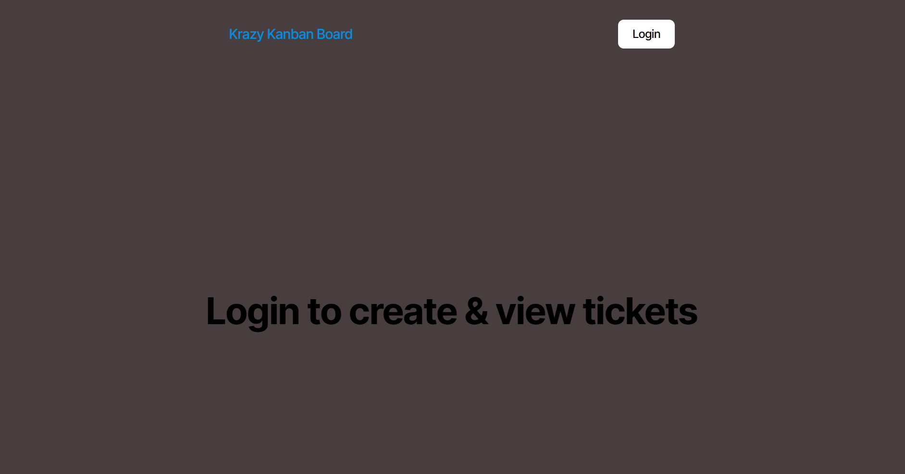
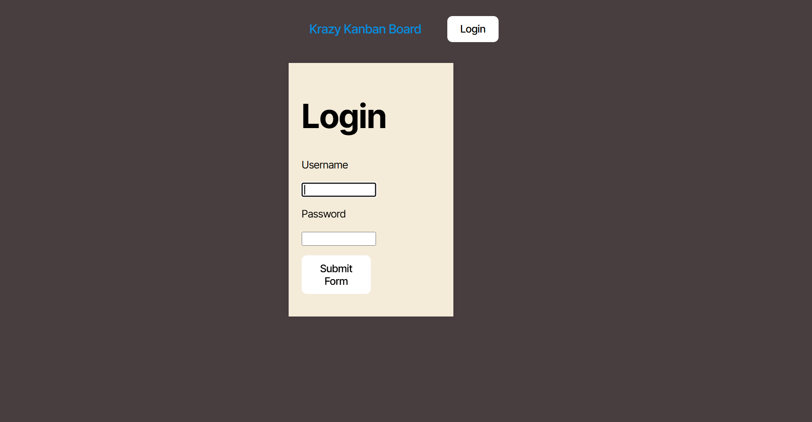
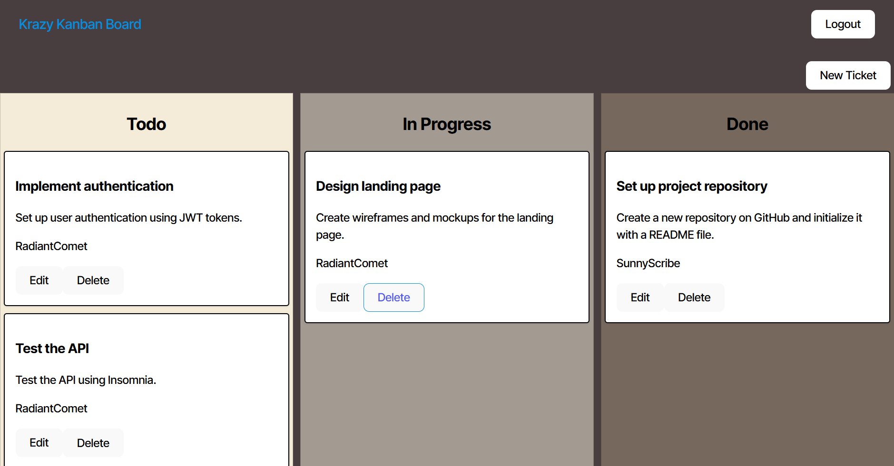
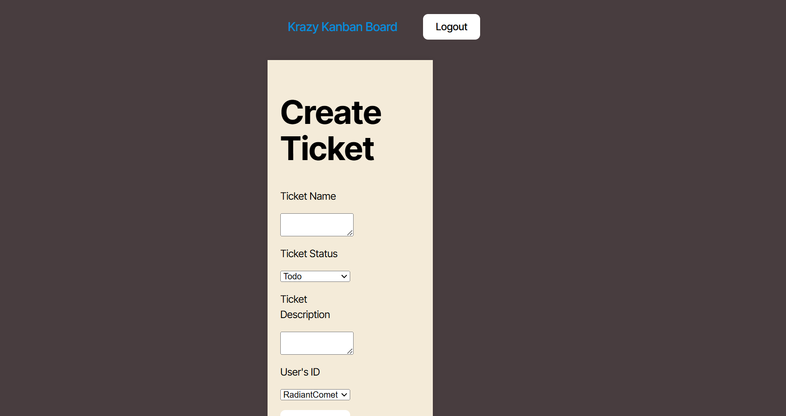

# Krazy Kanban Board

  

## User Story 
AS A member of an agile team
I WANT a Kanban board with a secure login page
SO THAT I can securely access and manage my work tasks 

## Decription
Krazy Kanban Board is a web application that allows users to manage tasks using a Kanban board. It includes features for user authentication, task creation, updating, and deletion.

## Features

- User Authentication
- Create, Read, Update, Delete (CRUD) operations for tasks
- Task assignment to users
- Task status management (Todo, In Progress, Done)

## Installation

1. Clone the repository:
    
    git clone https://github.com/Terrencethe1/kanban-board.git
    cd kanban-board
    

2. Install dependencies:
    
    npm run install
    

3. Set up the database:

    - Create a PostgreSQL database and update the [.env](http://_vscodecontentref_/12) file in the [server](http://_vscodecontentref_/13) directory with your database credentials.

4. Seed the database:
    
    npm run seed

### Production

To build and start the production server, run:
npm run build, npm start

### Authentication
- `POST /auth/login` - Login a user

### Users
- `GET /api/users` - Get all users
- `GET /api/users/:id` - Get a user by ID
- `POST /api/users` - Create a new user
- `PUT /api/users/:id` - Update a user by ID
- `DELETE /api/users/:id` - Delete a user by ID

### Tickets
- `GET /api/tickets` - Get all tickets
- `GET /api/tickets/:id` - Get a ticket by ID
- `POST /api/tickets` - Create a new ticket
- `PUT /api/tickets/:id` - Update a ticket by ID
- `DELETE /api/tickets/:id` - Delete a ticket by ID

## License

This project is licensed under the MIT License.

## Deployed Link
https://kanban-board-la2m.onrender.com 

 
 
 

